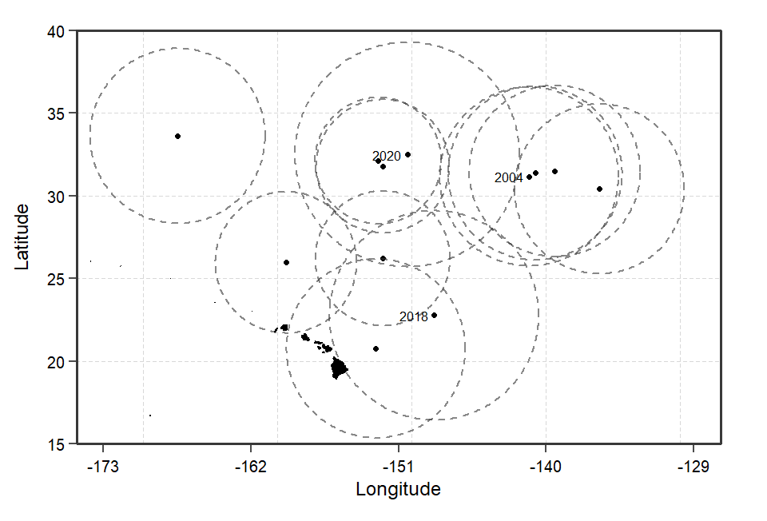
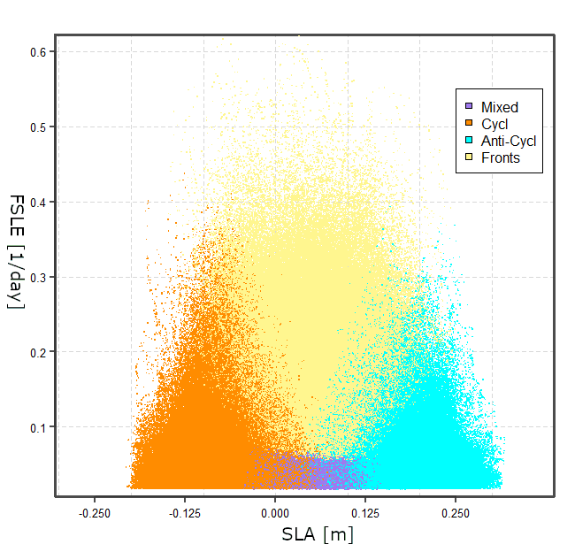

```{r setup, include=FALSE}
knitr::opts_chunk$set(echo = TRUE)
# if you put library(kableExtra) in a separate R file that is sourced
# by the rmarkdown document, these packages won’t be loaded. 
library(kableExtra)
library(lubridate)
#setwd("C:\\Users\\james\\Desktop\\jamieslife\\doc")
```

\newpage  

## Table 1: Summary table of late summer CHL blooms in the NPSG
```{r, echo=FALSE, out.width='65%', fig.show='hold', fig.cap = ""}
tbl = read.csv("../data/full_sum_20220829.csv")
idx = !year(tbl$sdate) == 2008
tbl = tbl[idx,]
tbl$duration[nrow(tbl)] = 92
rownames(tbl) = NULL
tbl = tbl[, 2:ncol(tbl)]
tbl = tbl[,c(1,3:7)]
tbl$area = tbl$area/100000
tbl[2:6] = round(tbl[2:6], 2)

colnames(tbl) = c("Start Date", "Duration", "Magnitude", "Area", "Longitude", "Latitude")
units = c("\n [HST]", "\n [days]", "\n $[mg$ $m^{-3}]$", "\n $[km^2 10^5]$", "\n [degrees]", "\n [degrees]")
cols = paste(colnames(tbl), units, sep = "")
colnames(tbl) = linebreak(cols)

#cols = c("Start Date", "Duration", "Magnitude", "Area", "Longitude", "Latitude")
#units = c("[HST]", "[days]", "$\\mg m^{-3}$", "$\\km^2 10^5$", "[degrees]", "[degrees]")
#colnames(tbl) = cols
#tbl = rbind(units, tbl)

#idx = !year(tbl$sdate) == 2008
#tbl = tbl[idx,]
kbl(tbl,
    escape = FALSE,
    booktabs = T, 
    col.names = cols,
    caption = "Summary statistics of each bloom around Stn. ALOHA and 30N between 2002 to 2019. Magnitude taken as the maximum CHL $mg/m^3$ value the blooms reached, and area is the maximum area the bloom reached.") %>%
  kable_styling(full_width = F, latex_options = "HOLD_position") %>%
  #row_spec(1, bold = F, color = "black") %>%
  column_spec(1:6, width = "6em")
  #row_spec(c(4, 5, 8, 11, 12, 17), bold = F, color = "black", background = "#add8e6")
  # add_header_above(c("HST" = 1)) %>%
  # add_header_above(c("days" = 2)) %>%
  # add_header_above(c("[mg/m^3]" = 3)) %>%
  # add_header_above(c("[km^2 10^5]" = 4)) %>% 
  # add_header_above(c("degrees" = 5)) %>%
  # add_header_above(c("degrees" = 6))

#latex_options = c("striped")
```

\newpage 

## Figure 1: Monthly Composites of $CHL_{sat}$ in the NPSG
\captionsetup{justification=justified,margin=1.5cm}
```{r,echo=FALSE, fig.align='center',  fig.fullwidth=TRUE, out.width='75%', fig.show='hold', fig.cap="Monthly images of CHL bloom values within the chosen study region of the NPSG. Each row shows a unique year, and the five late summer months in which the blooms occur. The Hawaiian islands are shown in the bottom left. Bloom values are found using the CHL anomaly product."}
knitr::include_graphics(c('../figures/thumbnail_20220713_latesummer.png'))
```

\newpage 

## Figure 2: Bloom centers and maximum area
\captionsetup{justification=justified,margin=0.5cm}
```{r, echo=FALSE, fig.align='center', out.width = '100%', fig.show='hold', fig.cap = "Bloom centers for all summer to fall blooms that occur between 2003-2021. The area of each circle is equal to the maximum area each bloom reached, calculated from the 1-day L3 CHL product (erdMH1chla1day)."}

```


\newpage  

## Figure 3: Bloom duration and day of year
\captionsetup{justification=justified,margin=0.5cm}
```{r, echo = FALSE, fig.align='center', out.width = '100%', fig.show='hold', fig.cap = "Bar plot of the bloom duration for all summer to fall blooms that occur between 2003-2021. Start and end date of each bloom (table 1) found using an STL filter. The length of each bar is equal to the duration described in table 1, as well as the start date of each bloom. The grey center line is the middle of each bloom, found as the mean of the bloom start and end date."}
#knitr::include_graphics(c('..//figs/bloom_duration_2.png'))
knitr::include_graphics(c('..//figures/bloom_durations_20220829.png'))
```


\newpage  

## Figure 4: HPLC against Satellite CHL Comparison and CHL Climatologies
\captionsetup{justification=justified,margin=3cm}
```{r, echo=FALSE, fig.align='center', fig.fullwidth=TRUE, fig.show='hold',out.width = "55%", fig.cap="Comparison of High-pressure Liquid Chromatography (HPLC) bottle samples against the GlobColor CHL1 Lm3 satellite product. The generalized linear regression (family = gamma) gives an $r^2$ value of $0.454$ with a significant fit ($p < 0.05$). Figure b) a box plot of the average monthly CHL satellite signal across the 18 years of data. The light grey boxes are for the region at 30N, and the dark grey box is for the region around Stn. ALOHA."}
knitr::include_graphics( '..//figures/HPLC_CHL_clim.png')
```
\newpage 

## Figure 5: Two late summer CHL blooms relationship to fronts and eddies
\captionsetup{justification=justified,margin=0cm}
```{r, echo=FALSE, fig.align='center',  fig.fullwidth=TRUE, out.width='100%', fig.show='hold', fig.cap = "Plankton bloom for 2019 and 2020 overlaid by FSLE and eddies. Both blooms appear to be associated with frontal features with little apparent association to mesoscale eddies."}
knitr::include_graphics(c('..//figures/eddies_fronts_blooms.png'))
```

\newpage  

\captionsetup{justification=justified,margin=1cm}
## Figure 6:  k-means cluster analysis of (sub)mesoscale regions
```{r, echo=FALSE, fig.align='center', fig.fullwidth=TRUE, out.width="100%", fig.show='hold', fig.cap="K-means cluster analysis (method = euclidean distance, k = 4, scale = 0-1) applied to the FSLE, and SLA fields at St. ALOHA during the late summer months (July-October) of 2018. The cluster analysis groups each data point into one of four (sub)mesoscale regions: mesoscale positive, mesoscale negative, submesoscale, and mixed regions."}

``` 

\newpage  

## Figure 7: Spatio-temporal evolution of the 2018 bloom
\captionsetup{justification=justified,margin=0.5cm}
```{r, echo=FALSE, fig.align='center', fig.fullwidth=TRUE,  out.width='100%', fig.show='hold', fig.cap = "8 day composites showing the start and demise of the 2018 bloom in the NSPG. Bloom values are chosen using the CHL anomaly. Strong frontal features  from FSLE satellite data are shown as black lines. Day of the year is shown in the top left corner of each plot"}
knitr::include_graphics(c('..//figures/thumbnail_2018_20220719.png'))
```

\newpage  

## Figure 8: Satellite-based time series of the 2018 bloom
\captionsetup{justification=justified,margin=4cm}
```{r, echo=FALSE, fig.align='center', out.height = '65%', fig.show='hold', fig.cap = "Timeseries progression of the onset and demise of the 2018 bloom in the NPSG. Black and grey lines (95\\% confidence interval) are a GAM smoother. Figure a) shows the surface, figure b) shows the biomass, and figure c) shows the depth integrated CHL concentration."}
knitr::include_graphics(c('..//figures/biomass_conc_area.png'))
```

\newpage  

## Figure 9: Spatial association of (sub)mesoscale features across the lifespan of the 2018 bloom
\captionsetup{justification=justified,margin=3cm}
```{r, echo=FALSE, fig.align='center', out.height = '65%', fig.show='hold', fig.cap = "Timeseries of bloom percent association (deviation from the background) of bloom values to cyclonic eddies, anti-cyclonic eddies and frontal features. Percent association is the percent of each (sub)mesoscale region’s area that is associated with a bloom feature."}
knitr::include_graphics(c('..//figures/submeso_timeseries.png'))
```


```{r, eval = FALSE, echo=FALSE, out.width='65%', fig.show='hold'}
library(anytime)
library(kableExtra)
aloha <- read.csv("../data/outfiles/association_table.csv")
aloha[, 4:ncol(aloha)] <- round(aloha[,4:ncol(aloha)], 2)
aloha <- aloha[, 2:ncol(aloha)]
colnames(aloha) <- c("Year", "Region", "Mesoscale", "Mesoscale", "Submesoscale", "Mixed")

ind <- sort(aloha$Region, index.return = TRUE)
aloha <- aloha[ind[2]$ix,]
rownames(aloha) <- NULL

kbl(aloha, 
    booktabs = T, 
    caption = "Results of the (sub)mesoscale percent contribution to each bloom around St. ALOHA and 30N between 2002 to 2019.") %>%
  kable_styling(full_width = F, latex_options = "HOLD_position") %>%
  column_spec(1, bold = F, color = "black") %>%
  column_spec(3:6, width = "8em")
  #pack_rows("30 North", 1, nrow(north)) %>%
  #pack_rows("St. ALOHA", nrow(north)+1, nrow(both)) %>%
  #row_spec(c(4, 5, 8, 11, 12, 17), bold = F, color = "black", background = "#add8e6")
  #add_header_above(c("Table of (sub)mesoscale contributions: St. ALOHA" = 5), bold=T)

#latex_options = c("striped")
```

```{r, eval = FALSE, echo=FALSE, fig.align='center', out.width="100%", out.height="100%", fig.show='hold', fig.cap="K-means cluster analysis (method = euclidean distance, k = 4, scale = 0-1) applied to the FSLE, and SLA fields at St. ALOHA during the late summer months (July-October) of 2018. The cluster analysis groups each data point into one of four (sub)mesoscale regions: mesoscale positive, mesoscale negative, submesoscale, and mixed regions."}
knitr::include_graphics('..//figs/ALOHA_kgroups.png')
``` 

```{r,echo = FALSE, eval = FALSE, fig.align='center',  out.width='70%', out.height='70%', fig.show='hold'}
knitr::include_graphics(c('../figs/thumbnail_raw.png'))
```

```{r, echo=FALSE, eval = FALSE, fig.align='center',  out.width='70%', out.height='70%', fig.show='hold', fig.cap = "Monthly composites of merged GSM CHLsat between 2002-2019 during periods of summer-fall (July-October) blooms in the NPSG. The red point marks St. ALOHA's location."}
knitr::include_graphics(c('../figs/thumbnail_raw2.png'))
```

```{r, eval = FALSE, echo=FALSE, fig.align='center',  out.width='70%', out.height='70%', fig.show='hold'}
knitr::include_graphics(c('../figs/thumbnail_percent.png'))
```

```{r, eval = FALSE, echo=FALSE, fig.align='center',  out.width='70%', out.height='70%', fig.show='hold', fig.cap = "Contour plot of monthly composites of bloom frequency per grid cell between 2002-2019 during periods of summer-fall (July-October) \\\\ blooms in the NPSG. The red point marks St. ALOHA's location."}
knitr::include_graphics(c('../figs/thumbnail_percent2.png'))
```
  
```{r, eval = FALSE, echo=FALSE, fig.align='center', fig.fullwidth=TRUE, out.width ='90%', fig.show='hold', fig.cap = "Contour plot of bloom frequency per grid cell between 2002-2021 during periods of summer-fall (July-October) blooms in the NPSG. Bloom frequency being the time spent above the bloom threshold (mean + std) per grid cell during the late summer months across the time domain."}
## Figure 3: Climatology of $CHL_{sat}$ in the NPSG
knitr::include_graphics(c('../figs/CHL_percover.png'))
```

```{r, eval = FALSE, echo=FALSE, fig.align='center',  fig.fullwidth=TRUE, out.width='100%', fig.show='hold', fig.cap = "Figure (a) shows FSLE as black contours overlaid on SLA during the peak of the 2018 bloom. AVISO outer eddy contours shown as black polygons. Figure (b) shows the output of the k-means cluster algorithm with the four identified regions: Submesoscale (black), mesoscale positive (red), mesoscale negative (blue), and mixed (white)."}
## Figure 4: Comparison of k-means (Sub)mesoscale Identification and AVISO Eddy Atlas
knitr::include_graphics(c('..//figs/submesoscale_20220715.png'))
```


